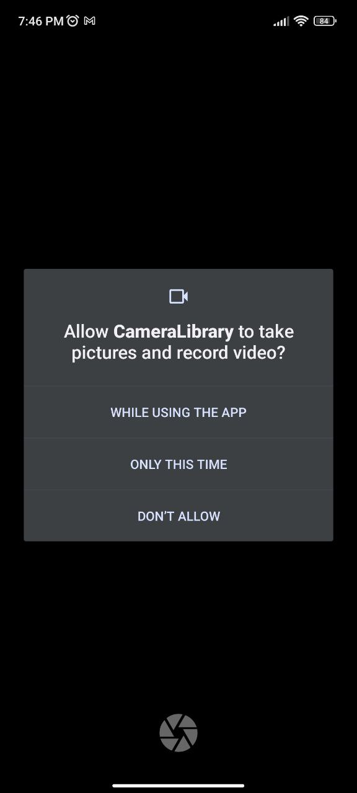
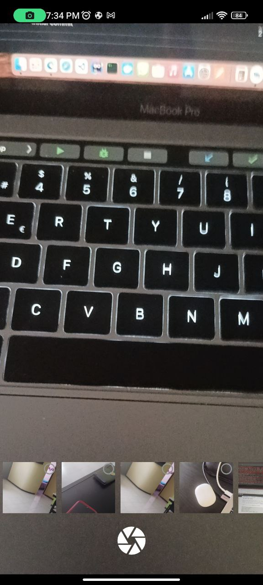
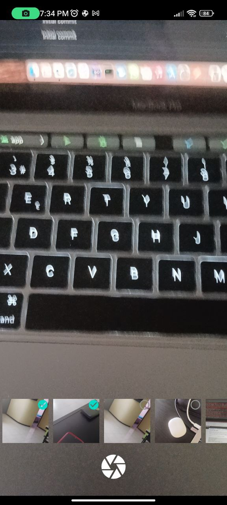

# EasyCameraAndGallery 0.5 beta version

|      Get Permission       |        Home Camera        |       Select photo        |        Send result        |
| :-----------------------: | :-----------------------: | :-----------------------: | :-----------------------: |
|  |  |  |  |

## Install
**Step 1.** Add it in your root build.gradle at the end of repositories:
```gradle
maven { url 'https://jitpack.io' }
```
**Step 2.** Add the dependency
```gradle
implementation 'com.github.AlfredoHdez1709:EasyCameraAndGallery:0.5-beta'
```

## Basic implementation

Generate call result from an activity

returns a list with paths of captured or selected images (List<String>)

```kotlin
    private lateinit var resultScan: ActivityResultLauncher<Intent>

    private fun initCall() {
        resultScan = registerForActivityResult(androidx.activity.result.contract.
        ActivityResultContracts.StartActivityForResult()) { result ->
                if (result.resultCode == Activity.RESULT_OK) {
                    val list = result.data?.getStringArrayListExtra(EasyCamera.IMAGE_RESULTS)
                    print(list)
                }
            }
    }
```

Launch the camera send as parameter the context, options and result

```kotlin
EasyCamera.start(this, OptionsCamera(), resultScan)
```

## Custom implementation

```kotlin

val optionsCamera = OptionsCamera(
            count = 1,
            path = "CustomFolder",
            flash = Flash.Auto,
            isFrontFacing = true,
            ratio = Ratio.RATIO_16_9
        )

EasyCamera.start(this, optionsCamera, resultScan)
```
