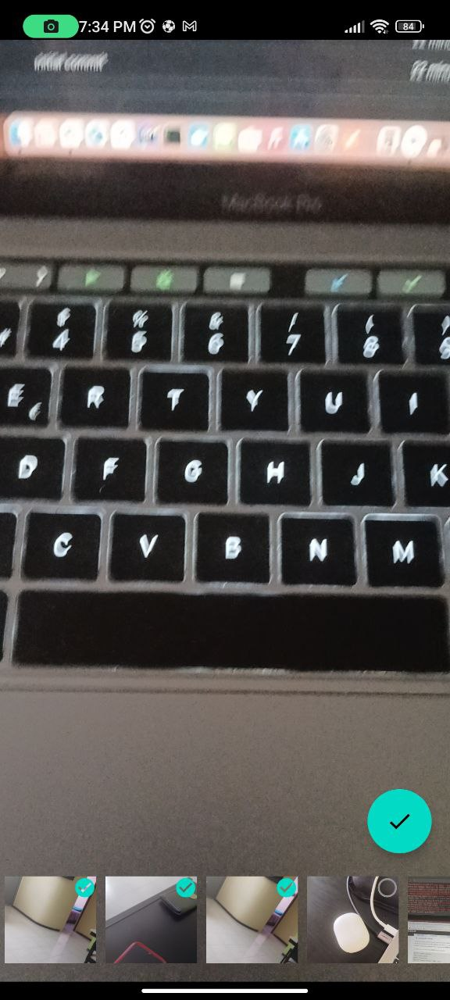

# EasyCameraAndGallery


|      Get Permission       |        Home Camera        |       Select photo        |        Send result        |
| :-----------------------: | :-----------------------: | :-----------------------: | :-----------------------: |
|  |  |  |  |

## Install
[](https://jitpack.io/#AlfredoHdez1709/EasyCameraAndGallery)

**Step 1.** Add it in your root build.gradle at the end of repositories:
```gradle
maven { url 'https://jitpack.io' }
```
**Step 2.** Add the dependency
```gradle
implementation 'com.github.AlfredoHdez1709:EasyCameraAndGallery:{version}'
```

## Basic implementation

Generate call result from an activity

returns a list with paths of captured or selected images (List<String>)

```kotlin
    private lateinit var resultScan: ActivityResultLauncher<Intent>

    private fun initCall() {
        resultScan = registerForActivityResult(androidx.activity.result.contract.
        ActivityResultContracts.StartActivityForResult()) { result ->
                if (result.resultCode == Activity.RESULT_OK) {
                    val list = result.data?.getStringArrayListExtra(EasyCamera.IMAGE_RESULTS)
                    print(list)
                }
            }
    }
```

Launch the camera send as parameter the context, options and result

```kotlin
EasyCamera.start(this, OptionsCamera(), resultScan)
```

## Custom implementation

```kotlin

val optionsCamera = OptionsCamera(
            count = 1,
            path = "CustomFolder",
            flash = Flash.Auto,
            isFrontFacing = true,
            ratio = Ratio.RATIO_16_9
        )

EasyCamera.start(this, optionsCamera, resultScan)
```

| Attributes    | Type    | Note                                                     |
| ------------- | ------- | -------------------------------------------------------- |
| count         | Int     | Number of captured images.                               |
| path          | String  | Folder where the images are saved. pictures/customFolder |
| flash         | Flash   | Control the flash of your implementation.                |
| isFrontFacing | Boolean | Turn on the front camera by default.                     |
| ratio         | Ration  | Control the dimensions of your captured image.           |

## Thanks to
  - [Glide]
  - [CameraX]
  - [Coroutines]

## License
Licensed under MIT, [click here for the full license](/LICENSE).

## Author & support
This project was created by [AHRSOFT](https://www.ahrsoft.dev/).

> If you appreciate my work, consider buying me a cup of :coffee: to keep me recharged :metal: by [PayPal](https://paypal.me/AlfredoHdez1709)


[Glide]: <https://github.com/bumptech/glide>
[CameraX]: <https://developer.android.com/training/camerax>
[Coroutines]: <https://developer.android.com/kotlin/coroutines>
